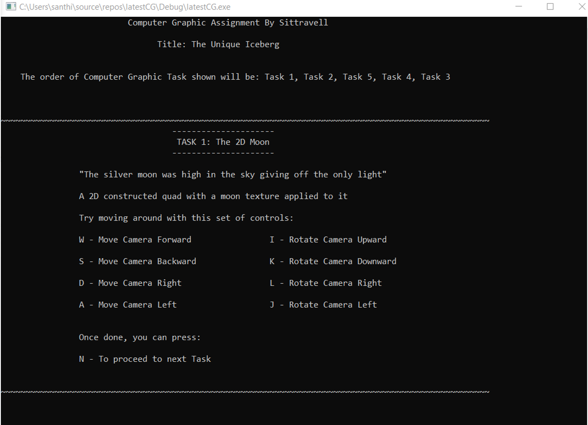
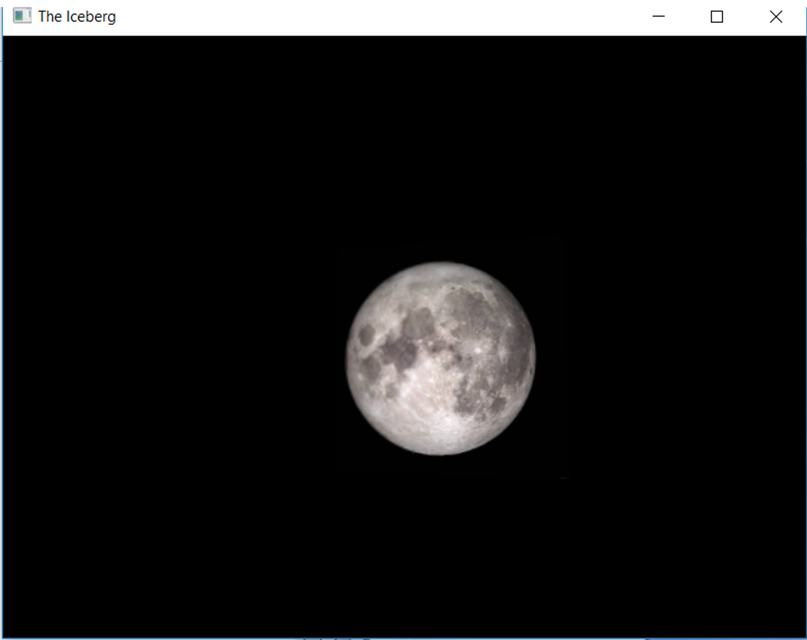
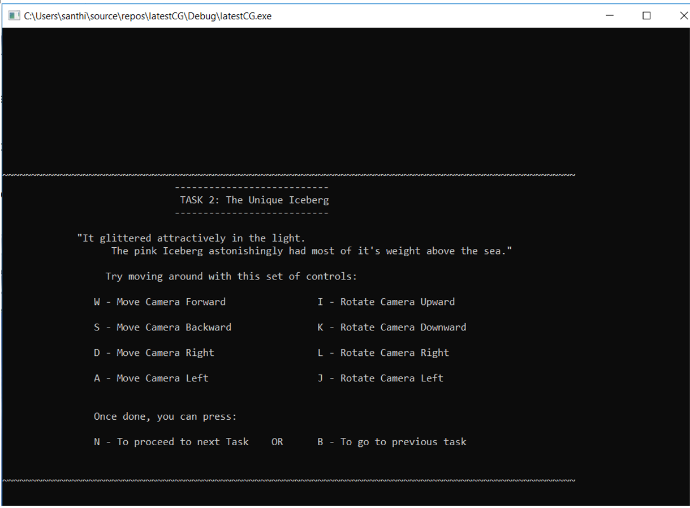
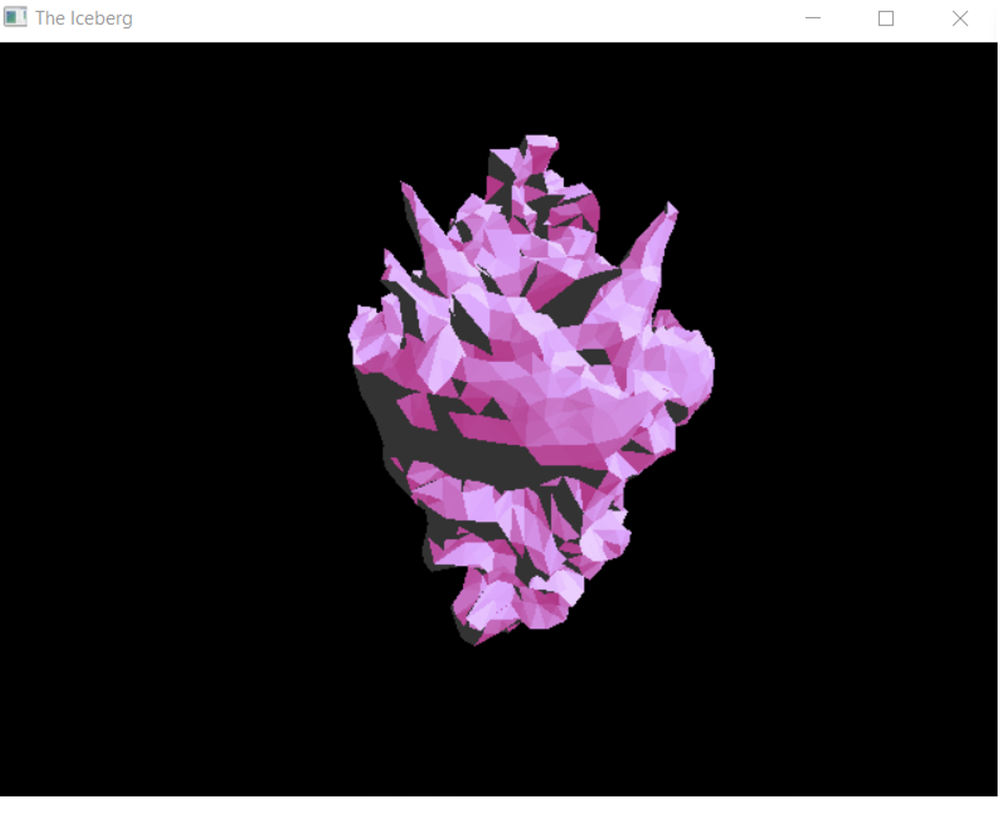
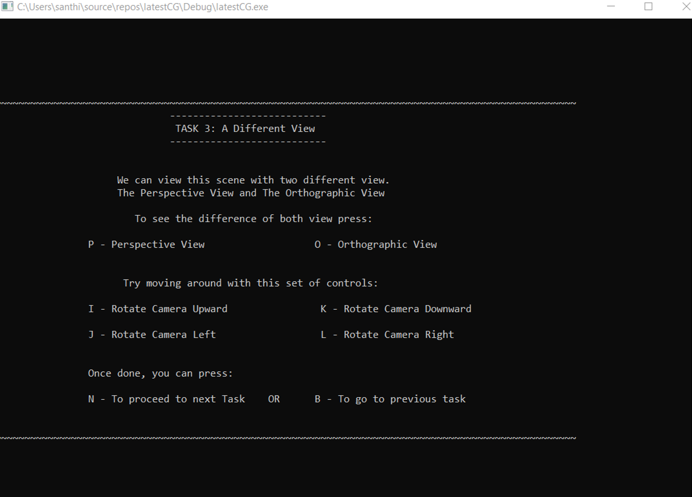
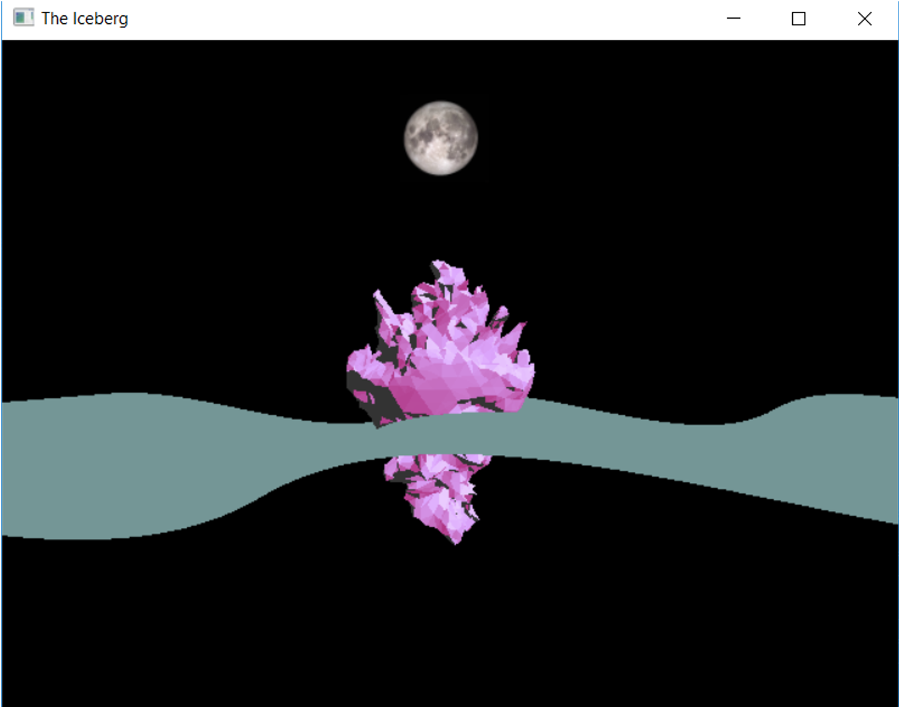
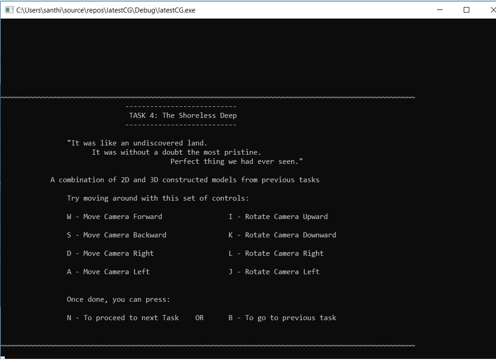
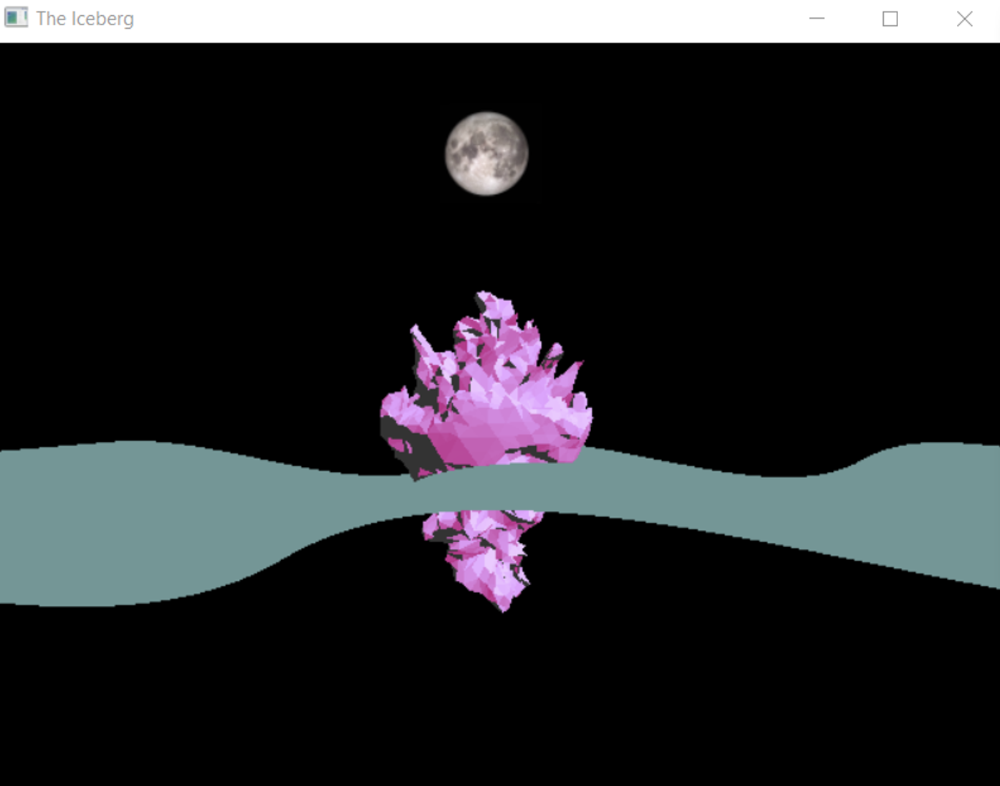
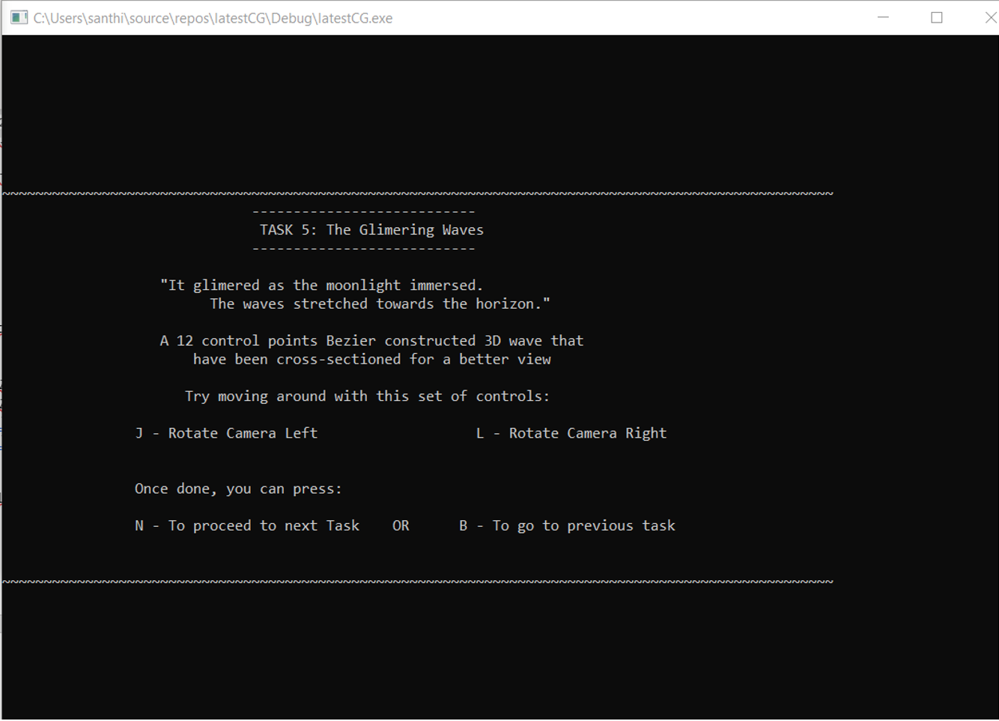
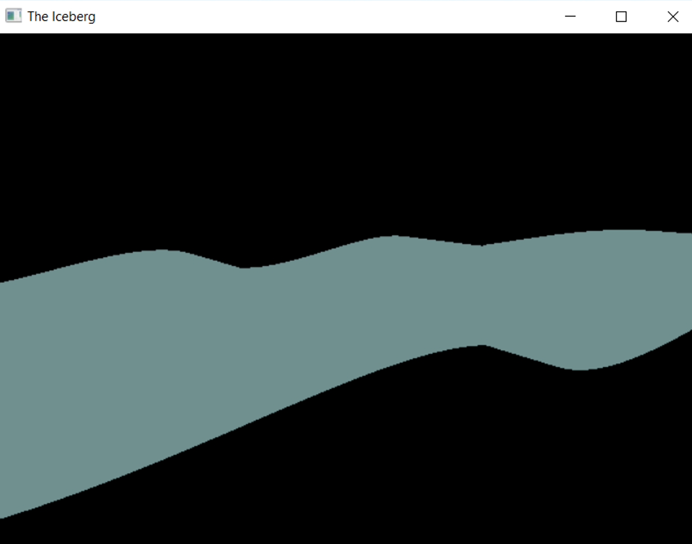

# TheIceberg
A demonstration of various Computer Graphic techniques using a pink iceberg floating in the middle of an ocean. This was developed using OpenGL written in C++ and Blender

## Screenshots

